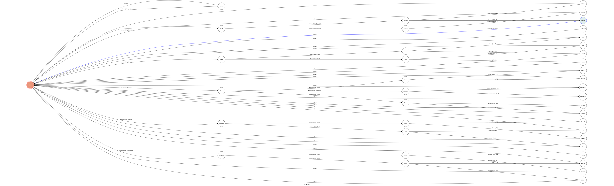

# TOC Project 2017

Code for TOC Project 2017

A telegram bot based on a finite state machine

## Author
Wen-Kai Tsai (F74022010)


## Run

### Setup (Choose one of the two ways)

#### Use my bot
* Search F74022010testbot in Telegram.

#### Use API_token
* You can copy my API_token to your bot to run.

### Connect ngrok
* Run ngrok to get the link for webhook.

### Start

#### Command line

```sh
python3 app.py
```

## Interacting
This is an interacting story. There are 22 endings.

### Initial
* Type "0" to check out if the state is in the start state.
    * Correct result will be "New adventure begins......." in Chinese on the screen.

### Follow the instruction
* The bot will ask you to type certain input to continue the program, just follow the hints.

### FSM
* There are 5 transactions from the initial state.
    * Excluding a state to show the first instruction and go back to initial state automatically.

* All endings must pass by 3 states to achieve.

* When the ending is shown, the state will go back to initial state automatically.


## Finite State Machine
